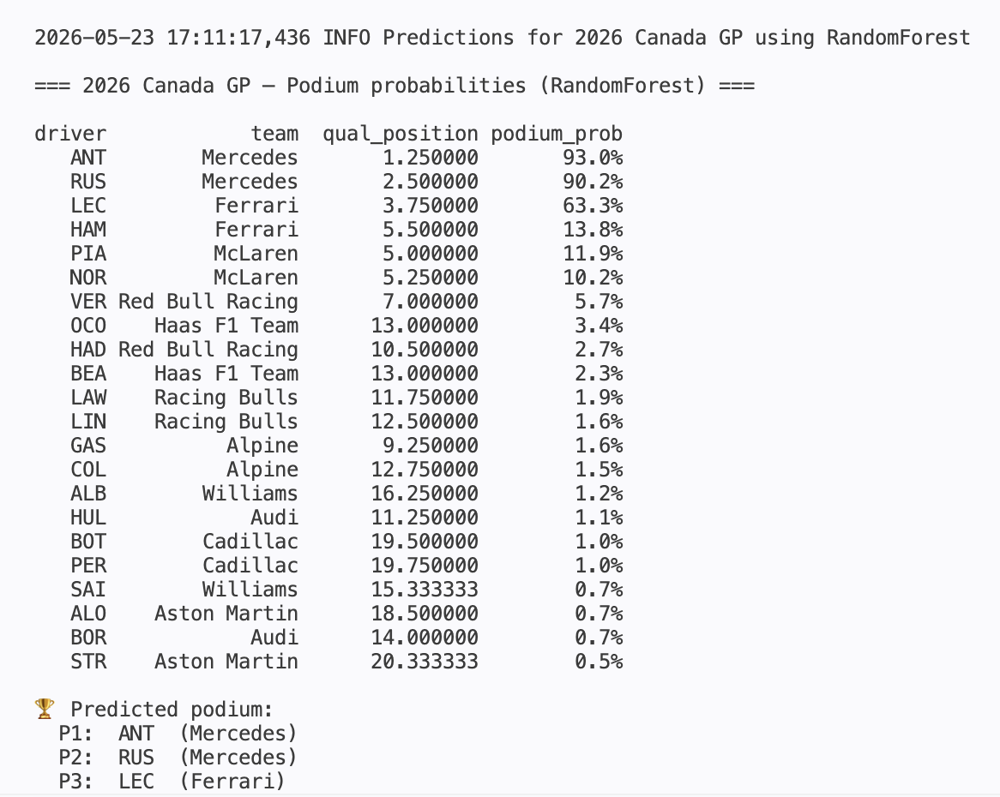

# 🇨🇦 F1 Canadian GP Podium Predictor

Open-source machine learning pipeline that predicts the **top-3 finishers** of the Formula 1 Canadian Grand Prix at Circuit Gilles-Villeneuve in Montreal.

Built on:
- **[FastF1](https://github.com/theOehrly/Fast-F1)** — open-source library that pulls from F1's official live timing API (results, laps, telemetry, weather)
- **scikit-learn**, **XGBoost**, **LightGBM** — gradient-boosted and linear models
- **Jolpica-F1** — Ergast-compatible historical results API (auto-used by FastF1)

## What it does

The pipeline:

1. **Pulls historical race data** for past Canadian GPs (2018 → present) plus the current season's races so far — including FP1/FP2 sessions, qualifying telemetry, and race-day weather.
2. **Engineers features**:
   - Driver form: rolling avg finish, qualifying pace, points, DNF rate
   - FP1/FP2 long-run pace delta vs field median (largest missing signal in most F1 models)
   - Race-day weather: rain flag, air temperature, track temperature
   - Qualifying telemetry: per-driver top speed vs field median (straight-line advantage)
   - Track-specific history: past Canada starts, avg finish, podiums — for driver and team
3. **Trains and compares 5 models**:
   - Logistic Regression (baseline)
   - Random Forest
   - XGBoost
   - LightGBM (binary podium classifier)
   - **LightGBM LambdaRank** — learning-to-rank on full finishing order
4. **Evaluates** with time-aware leave-one-year-out CV — no data leakage from future races.
5. **Predicts the 2026 Canadian GP** — outputs podium probabilities (classifiers) or full finishing-order scores (LambdaRank), picks the best model by top-3 hit rate.

## Sample output



## Quick start

```bash
# 1. Install
pip install -r requirements.txt

# 2. Pull data + train + predict (one command)
python -m src.run_pipeline

# Or step-by-step:
python -m src.fetch_data        # downloads & caches race data
python -m src.build_features    # builds the training dataset
python -m src.train             # trains all 5 models, picks the best
python -m src.predict           # outputs the predicted podium
```

## Project structure

```
f1-canada-predictor/
├── src/
│   ├── config.py          # constants: years, track name, drivers
│   ├── fetch_data.py      # uses FastF1 to pull session data
│   ├── build_features.py  # feature engineering
│   ├── train.py           # model training + comparison
│   ├── predict.py         # produces the 2026 prediction
│   └── run_pipeline.py    # end-to-end runner
├── data/                  # parquet files (created by fetch_data)
├── models/                # trained model artifacts
├── cache/                 # FastF1's API cache
└── requirements.txt
```

## Notes on the approach

- **Why podium classification?** Predicting an exact finishing order is extremely hard given DNFs, safety cars, and weather. Predicting a binary "did this driver finish top-3" is more tractable and what most public F1 ML projects target.
- **Why these features?** F1 races are mostly decided by car pace + qualifying position. Recent form (last 3 races) is the strongest signal — drivers in cars on a hot streak tend to keep producing.
- **Time-aware split**: We never train on a race that happened *after* the race we're testing on. This is critical and easy to get wrong.
- **2026 caveat**: This is the first year of major reg changes. Models trained primarily on 2026 data will be most reliable; use earlier seasons for *track*-specific signal only.

## Improving the model

1. Pull **full-season race history** for form features — currently form is approximated using Canada-only history; pulling every race of every season would give much richer rolling-form signals.
2. Add a **Monte Carlo simulation** that samples DNF probability per driver to produce finishing-order distributions rather than point estimates.
3. **Ensemble** the binary classifier and LambdaRank scores — combining podium probability with rank score often outperforms either alone.
4. Add **FP3 / Sprint Qualifying pace** on sprint weekends where FP2 is replaced.
5. Feed in a **weather forecast** for race day before sessions run — Montreal is famously rain-prone and wet-race prediction currently relies on historical averages.
